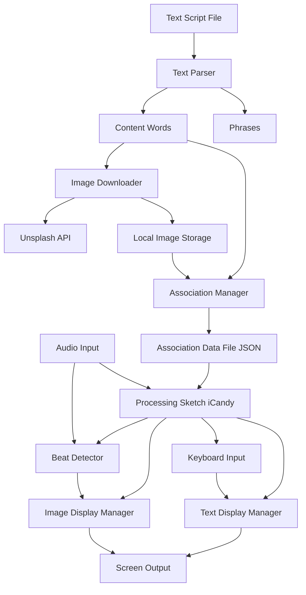

# Design Document: iCandy

## Overview

iCandy is a Processing.org-based visual text processor that creates dynamic, beat-synchronized visual experiences. The system consists of two distinct phases:

1. **Build Phase**: A preprocessing stage that parses text scripts, searches for images using the Unsplash API, downloads them, and creates persistent word-to-image associations
2. **Run Phase**: A real-time Processing sketch that displays text phrases like movie subtitles alongside associated images, with beat-synchronized image transitions using Processing's Sound library

The architecture separates concerns between data preparation (build phase) and real-time rendering (run phase), allowing for efficient preprocessing and smooth visual performance.

## Architecture

### High-Level Architecture



**Build Phase**: Text Script → Parser → Content Words (filtered) → Image Download → Associations Saved

**Run Phase**: Associations Loaded → Display Phrases + Images → Beat Detection + Keyboard Navigation

### Phase Separation

The two-phase architecture provides several benefits:
- **Build Phase** can be run offline without real-time constraints
- **Run Phase** has all assets preloaded for smooth performance
- Image downloads don't block the visual experience
- Users can rebuild associations without affecting saved data

### Technology Stack

- **Processing.org**: Core rendering framework (Java-based)
- **Processing Sound Library**: Beat detection via `BeatDetector` class
- **Unsplash API**: Free, high-quality image search and download
- **JSON**: Data serialization for word-image associations
- **Java HTTP Client**: For API requests and image downloads

## Components and Interfaces

### Build Phase Components

#### 1. TextParser

Responsible for reading and parsing text script files.

```java
class TextParser {
  String[] parseIntoWords(String textContent);
  String[] parseIntoPhrases(String textContent);
  String[] filterStopWords(String[] words);
  boolean isStopWord(String word);
  Map<Integer, String[]> mapPhrasesToWords(String[] phrases);
}
```

**Responsibilities**:
- Read text files from disk
- Split text into individual words for image association
- Filter out stop words (common words like "a", "the", "that", "is", "in", etc.)
- Split text into displayable phrases (sentences or natural breaks)
- Create mapping from phrase index to content words in that phrase
- Handle punctuation and special characters
- Validate input files

**Stop Words List**:
Common English stop words to exclude from image lookup:
- Articles: a, an, the
- Pronouns: I, you, he, she, it, we, they, me, him, her, us, them
- Prepositions: in, on, at, to, for, of, with, from, by
- Conjunctions: and, or, but, so, yet
- Common verbs: is, are, was, were, be, been, being, have, has, had
- Others: that, this, these, those, what, which, who, when, where, why, how

This list should be configurable via a text file.

#### 2. ImageDownloader

Handles communication with Unsplash API and downloads images.

```java
class ImageDownloader {
  String[] searchImages(String query, int count);
  boolean downloadImage(String imageUrl, String localPath);
  void setApiKey(String apiKey);
}
```

**Responsibilities**:
- Authenticate with Unsplash API
- Search for images by keyword
- Download images to local storage
- Handle network errors and retries
- Respect API rate limits

**Unsplash API Integration**:
- Endpoint: `https://api.unsplash.com/search/photos?query={word}&per_page={count}`
- Requires API key in Authorization header
- Returns JSON with image URLs and metadata
- Free tier: 50 requests per hour

#### 3. AssociationManager

Manages the mapping between words and their associated images.

```java
class AssociationManager {
  void addAssociation(String word, String[] imagePaths);
  String[] getImagesForWord(String word);
  void saveToFile(String filepath);
  void loadFromFile(String filepath);
  boolean verifyImageFiles();
}
```

**Responsibilities**:
- Maintain word-to-image mappings in memory
- Serialize associations to JSON
- Deserialize associations from JSON
- Verify image file existence
- Handle missing files gracefully

**Data Format** (JSON):
```json
{
  "associations": {
    "hello": ["images/hello_1.jpg", "images/hello_2.jpg"],
    "world": ["images/world_1.jpg", "images/world_2.jpg"]
  },
  "metadata": {
    "created": "2026-01-03T10:00:00Z",
    "imageCount": 4,
    "wordCount": 2
  }
}
```

#### 4. BuildOrchestrator

Coordinates the build phase workflow.

```java
class BuildOrchestrator {
  void runBuild(String textFilePath, String outputDir, int imagesPerWord);
}
```

**Responsibilities**:
- Orchestrate the complete build workflow
- Load configuration
- Coordinate TextParser, ImageDownloader, and AssociationManager
- Report progress and errors
- Handle partial failures gracefully

#### 4a. BuildMain

Main entry point for the build phase.

```java
class BuildMain {
  public static void main(String[] args);
  void parseCommandLineArgs(String[] args);
  void displayUsage();
}
```

**Responsibilities**:
- Provide command-line interface for build phase
- Parse command-line arguments (text file path, config file path)
- Instantiate and invoke BuildOrchestrator
- Display usage instructions
- Handle command-line errors

### Run Phase Components

#### 5. TextDisplayManager

Manages the display of text phrases on screen.

```java
class TextDisplayManager {
  void displayPhrase(String phrase, int x, int y);
  void updatePhrase(String nextPhrase);
  boolean shouldAdvance();
  int calculateDisplayDuration(String phrase);
}
```

**Responsibilities**:
- Render text with subtitle-like styling
- Calculate reading time based on phrase length
- Position text appropriately on screen
- Handle text transitions
- Support configurable fonts and colors

**Display Duration Calculation**:
- Base formula: `duration = (wordCount * 300ms) + 1000ms`
- Minimum duration: 2 seconds
- Maximum duration: 10 seconds
- Configurable via settings

#### 6. ImageDisplayManager

Manages the display and swapping of images.

```java
class ImageDisplayManager {
  void setImagesForPhrase(String[] words);
  void displayCurrentImages();
  void swapImages();
  void preloadImages(String[] imagePaths);
  void setSimultaneousImageCount(int count);
}
```

**Responsibilities**:
- Load and cache PImage objects
- Display images in visually appealing layouts
- Swap images on beat detection
- Track which images have been shown
- Cycle through available images
- Handle missing images gracefully
- Select subset of images when phrase has more content words than display slots

**Image Layout Strategy**:
- Display configurable number of images simultaneously (default: 3)
- Grid or collage layout
- Images scaled to fit screen regions
- Smooth transitions between swaps

**Image Selection Strategy**:
- When phrase has N content words and display shows M images (where N > M):
  - Randomly select M words from the N content words
  - Display one image from each selected word
- When phrase has fewer content words than display slots:
  - Display all available images
  - Fill remaining slots with images from same words (cycling)

#### 7. BeatDetectorWrapper

Wraps Processing's BeatDetector for easier integration.

```java
class BeatDetectorWrapper {
  void setup(AudioIn audioInput);
  boolean isBeat();
  void setSensitivity(int milliseconds);
}
```

**Responsibilities**:
- Initialize Processing Sound library's BeatDetector
- Set up microphone audio input
- Analyze audio input for beats
- Provide simple boolean interface for beat detection
- Allow sensitivity configuration
- Handle audio input failures

**Processing Sound Library Integration**:
- Uses `processing.sound.BeatDetector` class
- Uses `processing.sound.AudioIn` for microphone input
- `isBeat()` returns true when energy spike detected
- Sensitivity controls minimum time between beats
- Default sensitivity: 100ms

**Audio Input Source**:
- Primary: System microphone (default audio input device)
- Fallback: Timed transitions if microphone unavailable

#### 8. PhraseSequencer

Manages the sequence of phrases and timing with keyboard navigation.

```java
class PhraseSequencer {
  String getCurrentPhrase();
  String[] getWordsInCurrentPhrase();
  void advance();
  void goBack();
  boolean hasNext();
  boolean hasPrevious();
  void reset();
  int getCurrentIndex();
  void setLooping(boolean loop);
}
```

**Responsibilities**:
- Track current position in text script
- Provide current phrase and its words
- Advance to next phrase (automatic or via right arrow key)
- Go back to previous phrase (via left arrow key)
- Handle end of script (loop back to beginning by default)
- Handle beginning of script (can't go back further)
- Support configurable looping behavior

#### 9. iCandySketch (Main Processing Sketch)

The main Processing application that ties everything together.

```java
class iCandySketch extends PApplet {
  void setup();
  void draw();
  void keyPressed();
  void loadConfiguration();
}
```

**Responsibilities**:
- Initialize all run phase components
- Load associations from file
- Set up audio input and beat detection
- Coordinate display managers and sequencer
- Handle Processing lifecycle (setup/draw)
- Handle keyboard input (left/right arrow keys)
- Manage frame rate and rendering

### Configuration Component

#### 10. ConfigurationManager

Handles loading and validation of configuration settings.

```java
class ConfigurationManager {
  int getImagesPerWord();
  int getBeatSensitivity();
  String getUnsplashApiKey();
  String getAssociationsFilePath();
  void loadFromFile(String configPath);
}
```

**Configuration File** (JSON):
```json
{
  "build": {
    "imagesPerWord": 5,
    "unsplashApiKey": "YOUR_API_KEY",
    "imageStorageDir": "data/images",
    "associationsFile": "data/associations.json",
    "stopWordsFile": "data/stopwords.txt"
  },
  "run": {
    "beatSensitivity": 100,
    "minPhraseDuration": 2000,
    "maxPhraseDuration": 10000,
    "msPerWord": 300,
    "frameRate": 30,
    "textSize": 48,
    "textColor": "#FFFFFF",
    "backgroundColor": "#000000",
    "enableKeyboardNavigation": true,
    "simultaneousImageCount": 3,
    "loopPhrases": true,
    "audioSource": "microphone"
  }
}
```

## Data Models

### TextScript

Represents the parsed text script.

```java
class TextScript {
  String[] words;           // All unique words for image association
  String[] phrases;         // Displayable phrases in sequence
  Map<Integer, String[]> phraseToWords;  // Maps phrase index to its words
}
```

### ImageAssociation

Represents the association between a word and its images.

```java
class ImageAssociation {
  String word;
  String[] imagePaths;
  int downloadedCount;
  long timestamp;
}
```

### DisplayState

Tracks the current state of the run phase.

```java
class DisplayState {
  int currentPhraseIndex;
  String currentPhrase;
  String[] currentWords;
  PImage[] currentImages;
  int[] imageIndices;       // Track which image variant is shown per word
  long phraseStartTime;
  int phraseDuration;
}
```

### BeatState

Tracks beat detection state.

```java
class BeatState {
  boolean beatDetected;
  long lastBeatTime;
  int beatCount;
}
```


## Correctness Properties

*A property is a characteristic or behavior that should hold true across all valid executions of a system—essentially, a formal statement about what the system should do. Properties serve as the bridge between human-readable specifications and machine-verifiable correctness guarantees.*

### Property 1: Text Parsing Completeness

*For any* valid text file content, parsing should produce both a non-empty list of phrases and a non-empty list of unique words, and all words should be traceable to at least one phrase.

**Validates: Requirements 1.1, 1.3**

### Property 2: Stop Word Filtering

*For any* text script, words identified as stop words (articles, pronouns, common prepositions) should be excluded from image lookup, while content words should have images associated with them.

**Validates: Requirements 2.2**

### Property 3: Phrase Structure Preservation

*For any* parsed text, the phrases should maintain natural language boundaries (ending with sentence-ending punctuation or natural breaks) and each phrase should contain at least one word.

**Validates: Requirements 1.2**

### Property 4: Unique Word Processing

*For any* text script with N unique content words (after stop word filtering), the build phase should make exactly N image search requests (one per unique content word, no duplicates).

**Validates: Requirements 2.2, 2.4**

### Property 5: Configured Image Download Count

*For any* content word and configuration value N (images per word), the build phase should download exactly N images for that word and store them with references to the word.

**Validates: Requirements 2.5, 2.6**

### Property 6: Association Persistence Round-Trip

*For any* set of word-image associations created during the build phase, saving them to disk and then loading them back should produce equivalent associations.

**Validates: Requirements 2.8, 3.3**

### Property 7: Word-to-Image Mapping Integrity

*For any* content word that has downloaded images, querying the association manager should return the correct list of image file paths for that word.

**Validates: Requirements 3.1**

### Property 8: Image File Verification

*For any* loaded association, all referenced image file paths should either exist on disk or be flagged as missing with appropriate error handling.

**Validates: Requirements 3.4**

### Property 9: Sequential Phrase Display

*For any* sequence of phrases, they should be displayed in order from first to last, with each phrase displayed exactly once before moving to the next (when advancing automatically or via right arrow key).

**Validates: Requirements 4.1, 4.6, 4.8**

### Property 10: Backward Navigation

*For any* phrase at position P > 0, pressing the left arrow key should display the phrase at position P-1.

**Validates: Requirements 4.9**

### Property 11: Phrase Looping

*For any* phrase sequence, when the last phrase finishes displaying and looping is enabled, the system should return to the first phrase.

**Validates: Requirements 4.7**

### Property 12: Phrase-Image Association

*For any* displayed phrase containing content words W1, W2, ..., Wn (excluding stop words), all displayed images should come from the image sets associated with those content words.

**Validates: Requirements 4.3**

### Property 13: Duration Calculation Formula

*For any* phrase with W words, the calculated display duration should follow the formula: duration = (W × msPerWord) + baseDuration, bounded by minimum and maximum duration limits.

**Validates: Requirements 4.6**

### Property 14: Beat-Triggered Image Swap

*For any* beat detection event, the currently displayed images should be replaced with different images from the same words' image sets.

**Validates: Requirements 5.3**

### Property 15: Image Rotation Without Immediate Repetition

*For any* word with N images where N > 1, swapping images should select an image different from the currently displayed one until all images have been shown.

**Validates: Requirements 5.4, 5.5**

### Property 16: Image Stability Without Beats

*For any* time period where no beats are detected, the displayed images should remain unchanged.

**Validates: Requirements 5.6**

### Property 17: Configuration Effect on Behavior

*For any* configuration parameter (images per word, display duration, beat sensitivity), changing its value should affect the corresponding system behavior accordingly.

**Validates: Requirements 6.1, 6.2, 6.3**

### Property 18: Download Retry Limit

*For any* failed image download, the system should retry up to the configured maximum retry count before giving up and continuing with remaining words.

**Validates: Requirements 8.4**

## Error Handling

### Build Phase Error Handling

1. **Network Failures**:
   - Retry failed downloads with exponential backoff
   - Maximum retry count configurable (default: 3)
   - Log all failures with timestamps
   - Continue processing remaining words after max retries

2. **API Rate Limiting**:
   - Detect 429 (Too Many Requests) responses
   - Implement backoff strategy
   - Queue remaining requests
   - Provide progress feedback to user

3. **Invalid Text Files**:
   - Validate file exists and is readable
   - Check for empty files
   - Handle encoding issues
   - Return descriptive error messages

4. **File System Errors**:
   - Verify write permissions for image storage
   - Handle disk space issues
   - Validate directory creation
   - Clean up partial downloads on failure

### Run Phase Error Handling

1. **Missing Image Files**:
   - Detect missing files during association loading
   - Log warnings for missing files
   - Display phrases without images if all images missing
   - Continue execution without crashing

2. **Audio Input Failures**:
   - Detect when audio input is unavailable
   - Fall back to timed image transitions
   - Use configurable timer (default: 2 seconds per swap)
   - Log audio initialization errors

3. **Beat Detection Failures**:
   - Catch exceptions from BeatDetector
   - Fall back to timed transitions
   - Continue phrase display normally
   - Log detection errors

4. **Invalid Associations File**:
   - Validate JSON structure on load
   - Handle corrupted files gracefully
   - Provide clear error message
   - Suggest rebuilding associations

### Error Logging Strategy

All errors should be logged with:
- Timestamp
- Error type/category
- Descriptive message
- Context (which word, which file, etc.)
- Suggested remediation when applicable

Logs should be written to: `logs/icandy_YYYY-MM-DD.log`

## Testing Strategy

### Dual Testing Approach

iCandy will use both unit testing and property-based testing to ensure comprehensive coverage:

- **Unit tests**: Verify specific examples, edge cases, and error conditions
- **Property tests**: Verify universal properties across all inputs

Both approaches are complementary and necessary. Unit tests catch concrete bugs in specific scenarios, while property tests verify general correctness across a wide range of inputs.

### Property-Based Testing

We will use **QuickCheck for Java** (or **jqwik**) as our property-based testing library. Each correctness property defined above will be implemented as a property-based test.

**Configuration**:
- Minimum 100 iterations per property test
- Each test tagged with: `Feature: visual-text-processor, Property N: [property text]`
- Use custom generators for domain-specific data (text scripts, phrases, words)

**Test Organization**:
```
test/
  properties/
    TextParsingPropertiesTest.java
    BuildPhasePropertiesTest.java
    AssociationPropertiesTest.java
    DisplayPropertiesTest.java
    BeatDetectionPropertiesTest.java
    ConfigurationPropertiesTest.java
```

### Unit Testing

Unit tests will focus on:
- Specific examples that demonstrate correct behavior
- Edge cases (empty files, special characters, missing images)
- Error conditions (network failures, invalid config)
- Integration points between components

**Test Organization**:
```
test/
  unit/
    TextParserTest.java
    ImageDownloaderTest.java
    AssociationManagerTest.java
    TextDisplayManagerTest.java
    ImageDisplayManagerTest.java
    BeatDetectorWrapperTest.java
```

### Integration Testing

Integration tests will verify:
- Complete build phase workflow
- Complete run phase workflow
- Configuration loading and application
- File I/O operations
- API integration (with mocked Unsplash API)

### Test Data

**Generators for Property Tests**:
- Random text content with varying lengths
- Random word lists
- Random configuration values within valid ranges
- Random image file paths
- Random phrase sequences

**Fixtures for Unit Tests**:
- Sample text scripts (short, medium, long)
- Sample configuration files (valid, invalid, edge cases)
- Sample association files
- Mock image files
- Mock API responses

### Testing Edge Cases

Edge cases to explicitly test:
- Empty text files
- Text with only punctuation
- Text with special characters (Unicode, emojis)
- Very long phrases (> 100 words)
- Single-word phrases
- Configuration with zero or negative values
- Missing image files
- Corrupted association files
- Network timeouts
- API rate limit responses
- Audio input unavailable
- Beat detection with no audio

### Performance Testing

While not part of correctness properties, we should verify:
- Build phase completes in reasonable time (< 5 minutes for 100 words)
- Run phase maintains 30 FPS with 4 images displayed
- Memory usage stays under 500MB during run phase
- Image loading doesn't cause frame drops
