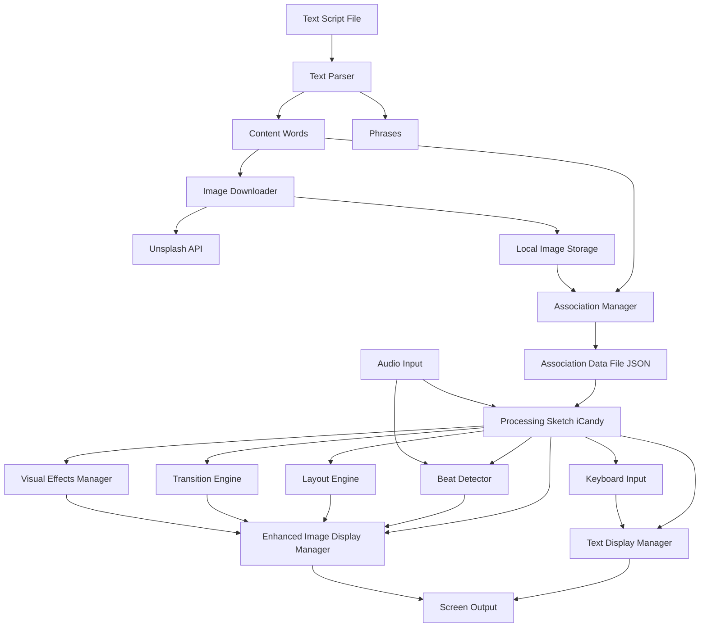

# Design Document: iCandy

## Overview

iCandy is a Processing.org-based visual text processor that creates dynamic, beat-synchronized visual experiences. The system consists of two distinct phases:

1. **Build Phase**: A preprocessing stage that parses text scripts, searches for images using the Unsplash API, downloads them, and creates persistent word-to-image associations
2. **Run Phase**: A real-time Processing sketch that displays text phrases like movie subtitles alongside associated images, with beat-synchronized image transitions using Processing's Sound library

The architecture separates concerns between data preparation (build phase) and real-time rendering (run phase), allowing for efficient preprocessing and smooth visual performance.

## Architecture

### High-Level Architecture


```mermaid
graph TB
    A[Text Script File] --> B[Text Parser]
    B --> C[Content Words]
    B --> D[Phrases]
    C --> E[Image Downloader]
    E --> F[Unsplash API]
    E --> G[Local Image Storage]
    C --> H[Association Manager]
    G --> H
    H --> I[Association Data File JSON]
    
    I --> J[Processing Sketch iCandy]
    K[Audio Input] --> J
    J --> L[Text Display Manager]
    J --> M[Enhanced Image Display Manager]
    J --> N[Beat Detector]
    J --> O[Keyboard Input]
    J --> P[Layout Engine]
    J --> Q[Transition Engine]
    J --> R[Visual Effects Manager]
    K --> N
    N --> M
    O --> L
    P --> M
    Q --> M
    R --> M
    L --> S[Screen Output]
    M --> S
```

**Build Phase**: Text Script → Parser → Content Words (filtered) → Image Download → Associations Saved

**Run Phase**: Associations Loaded → Display Phrases + Images → Layout Engine + Transition Engine + Visual Effects → Beat Detection + Keyboard Navigation

### Phase Separation

The two-phase architecture provides several benefits:
- **Build Phase** can be run offline without real-time constraints
- **Run Phase** has all assets preloaded for smooth performance
- Image downloads don't block the visual experience
- Users can rebuild associations without affecting saved data

### Technology Stack

- **Processing.org**: Core rendering framework (Java-based)
- **Processing Sound Library**: Beat detection via `BeatDetector` class
- **Unsplash API**: Free, high-quality image search and download
- **JSON**: Data serialization for word-image associations
- **Java HTTP Client**: For API requests and image downloads

## Components and Interfaces

### Build Phase Components

#### 1. TextParser

Responsible for reading and parsing text script files.

```java
class TextParser {
  String[] parseIntoWords(String textContent);
  String[] parseIntoPhrases(String textContent);
  String[] filterStopWords(String[] words);
  boolean isStopWord(String word);
  Map<Integer, String[]> mapPhrasesToWords(String[] phrases);
}
```

**Responsibilities**:
- Read text files from disk
- Split text into individual words for image association
- Filter out stop words (common words like "a", "the", "that", "is", "in", etc.)
- Split text into displayable phrases (sentences or natural breaks)
- Create mapping from phrase index to content words in that phrase
- Handle punctuation and special characters
- Validate input files

**Stop Words List**:
Common English stop words to exclude from image lookup:
- Articles: a, an, the
- Pronouns: I, you, he, she, it, we, they, me, him, her, us, them
- Prepositions: in, on, at, to, for, of, with, from, by
- Conjunctions: and, or, but, so, yet
- Common verbs: is, are, was, were, be, been, being, have, has, had
- Others: that, this, these, those, what, which, who, when, where, why, how

This list should be configurable via a text file.

#### 2. ImageDownloader

Handles communication with Unsplash API and downloads images.

```java
class ImageDownloader {
  String[] searchImages(String query, int count);
  boolean downloadImage(String imageUrl, String localPath);
  void setApiKey(String apiKey);
}
```

**Responsibilities**:
- Authenticate with Unsplash API
- Search for images by keyword
- Download images to local storage
- Handle network errors and retries
- Respect API rate limits

**Unsplash API Integration**:
- Endpoint: `https://api.unsplash.com/search/photos?query={word}&per_page={count}`
- Requires API key in Authorization header
- Returns JSON with image URLs and metadata
- Free tier: 50 requests per hour

#### 3. AssociationManager

Manages the mapping between words and their associated images.

```java
class AssociationManager {
  void addAssociation(String word, String[] imagePaths);
  String[] getImagesForWord(String word);
  void saveToFile(String filepath);
  void loadFromFile(String filepath);
  boolean verifyImageFiles();
}
```

**Responsibilities**:
- Maintain word-to-image mappings in memory
- Serialize associations to JSON
- Deserialize associations from JSON
- Verify image file existence
- Handle missing files gracefully

**Data Format** (JSON):
```json
{
  "associations": {
    "hello": ["images/hello_1.jpg", "images/hello_2.jpg"],
    "world": ["images/world_1.jpg", "images/world_2.jpg"]
  },
  "metadata": {
    "created": "2026-01-03T10:00:00Z",
    "imageCount": 4,
    "wordCount": 2
  }
}
```

#### 4. BuildOrchestrator

Coordinates the build phase workflow.

```java
class BuildOrchestrator {
  void runBuild(String textFilePath, String outputDir, int imagesPerWord);
}
```

**Responsibilities**:
- Orchestrate the complete build workflow
- Load configuration
- Coordinate TextParser, ImageDownloader, and AssociationManager
- Report progress and errors
- Handle partial failures gracefully

#### 4a. BuildMain

Main entry point for the build phase.

```java
class BuildMain {
  public static void main(String[] args);
  void parseCommandLineArgs(String[] args);
  void displayUsage();
}
```

**Responsibilities**:
- Provide command-line interface for build phase
- Parse command-line arguments (text file path, config file path)
- Instantiate and invoke BuildOrchestrator
- Display usage instructions
- Handle command-line errors

### Run Phase Components

#### 5. TextDisplayManager

Manages the display of text phrases on screen.

```java
class TextDisplayManager {
  void displayPhrase(String phrase, int x, int y);
  void updatePhrase(String nextPhrase);
  boolean shouldAdvance();
  int calculateDisplayDuration(String phrase);
}
```

**Responsibilities**:
- Render text with subtitle-like styling
- Calculate reading time based on phrase length
- Position text appropriately on screen
- Handle text transitions
- Support configurable fonts and colors

**Display Duration Calculation**:
- Base formula: `duration = (wordCount * 300ms) + 1000ms`
- Minimum duration: 2 seconds
- Maximum duration: 10 seconds
- Configurable via settings

#### 6. Enhanced ImageDisplayManager

Manages the display and swapping of images with configurable layouts and transitions.

```java
class ImageDisplayManager {
  void setImagesForPhrase(String[] words);
  void displayCurrentImages();
  void swapImages();
  void preloadImages(String[] imagePaths);
  void setSimultaneousImageCount(int count);
  void setLayoutEngine(LayoutEngine layoutEngine);
  void setTransitionEngine(TransitionEngine transitionEngine);
  void setVisualEffectsManager(VisualEffectsManager effectsManager);
  void update(float deltaTime);
}
```

**Responsibilities**:
- Load and cache PImage objects
- Coordinate with LayoutEngine for image positioning
- Coordinate with TransitionEngine for smooth image swaps
- Coordinate with VisualEffectsManager for visual enhancements
- Track which images have been shown
- Cycle through available images
- Handle missing images gracefully
- Select subset of images when phrase has more content words than display slots
- Update animations and transitions each frame

**Enhanced Features**:
- Pluggable layout algorithms via LayoutEngine
- Smooth animated transitions via TransitionEngine
- Visual effects and enhancements via VisualEffectsManager
- Frame-based animation system with delta time
- Configurable transition timing and easing

#### 11. LayoutEngine

Handles different algorithms for positioning images on screen.

```java
interface LayoutAlgorithm {
  ImagePosition[] calculatePositions(ImageInfo[] images, LayoutConfig config);
  void updatePositions(ImagePosition[] positions, float deltaTime);
}

class LayoutEngine {
  void setAlgorithm(LayoutAlgorithm algorithm);
  void setConfig(LayoutConfig config);
  ImagePosition[] calculateLayout(ImageInfo[] images);
  void animateToNewLayout(ImagePosition[] newPositions, float duration);
  void update(float deltaTime);
}
```

**Supported Layout Algorithms**:

1. **GridLayoutAlgorithm**: Arranges images in a regular rectangular grid
   - Configurable rows, columns, spacing, padding
   - Automatic grid sizing based on image count
   - Alignment options (center, left, right, top, bottom)

2. **CollageLayoutAlgorithm**: Creates artistic collage-style layouts
   - Random sizes within configured range
   - Random rotations within configured range
   - Controlled overlap with collision detection
   - Organic, non-uniform positioning

3. **CircularLayoutAlgorithm**: Arranges images in circular or spiral patterns
   - Configurable radius and arc span
   - Spiral mode with configurable pitch
   - Rotation direction (clockwise/counterclockwise)
   - Center point configuration

4. **FlowingLayoutAlgorithm**: Positions images along curved paths
   - Bezier curve path generation
   - Configurable flow direction and curvature
   - Organic spacing along paths
   - Multiple flow paths for complex layouts

**Layout Configuration**:
```java
class LayoutConfig {
  // Global settings
  Rectangle displayRegion;
  float globalScale;
  AspectRatioMode aspectRatioMode;
  
  // Grid-specific
  int gridRows, gridCols;
  float gridSpacing, gridPadding;
  Alignment gridAlignment;
  
  // Collage-specific
  float minSize, maxSize;
  float minRotation, maxRotation;
  float overlapAmount;
  
  // Circular-specific
  float circleRadius;
  float arcSpan;
  RotationDirection rotationDirection;
  
  // Flowing-specific
  float pathCurvature;
  FlowDirection flowDirection;
  float pathSpacing;
}
```

#### 12. TransitionEngine

Handles animated transitions between image states.

```java
interface TransitionEffect {
  void startTransition(ImageState from, ImageState to, float duration);
  ImageState updateTransition(float progress);
  boolean isComplete();
}

class TransitionEngine {
  void setEffect(TransitionEffect effect);
  void setConfig(TransitionConfig config);
  void startImageTransition(ImageInfo image, ImageState newState);
  void startLayoutTransition(ImagePosition[] newPositions);
  void update(float deltaTime);
  boolean hasActiveTransitions();
}
```

**Supported Transition Effects**:

1. **FadeTransition**: Gradually changes image opacity
   - Configurable fade duration
   - Cross-fade between old and new images
   - Alpha blending with easing functions

2. **SlideTransition**: Moves images in from specified directions
   - Configurable slide direction (up, down, left, right, diagonal)
   - Bounce and overshoot effects
   - Staggered timing for multiple images

3. **ZoomTransition**: Scales images in or out during swaps
   - Zoom in (scale from 0 to 1) or zoom out (scale from 1 to 0)
   - Configurable zoom center point
   - Combined with fade for smooth effect

4. **RotateTransition**: Rotates images during transitions
   - Configurable rotation angle and direction
   - Combined with scale and fade effects
   - 3D rotation effects using Processing's transform functions

5. **MorphTransition**: Blends between image shapes and positions
   - Shape interpolation between old and new positions
   - Color blending and morphing effects
   - Advanced vertex manipulation for organic transitions

**Transition Configuration**:
```java
class TransitionConfig {
  float duration;                    // Transition duration in milliseconds
  EasingFunction easingFunction;     // Linear, ease-in, ease-out, ease-in-out
  float staggerDelay;               // Delay between multiple image transitions
  boolean enableStagger;            // Whether to stagger multiple transitions
  
  // Effect-specific parameters
  SlideDirection slideDirection;
  ZoomMode zoomMode;
  float rotationAngle;
  BlendMode blendMode;
}
```

**Easing Functions**:
- Linear: Constant speed throughout transition
- Ease-in: Slow start, accelerating
- Ease-out: Fast start, decelerating
- Ease-in-out: Slow start and end, fast middle
- Bounce: Bouncing effect at the end
- Elastic: Elastic spring-like effect

#### 13. VisualEffectsManager

Applies visual effects and enhancements to images.

```java
class VisualEffectsManager {
  void setBlurEffect(float radius);
  void setColorFilter(ColorFilter filter);
  void setBrightnessContrast(float brightness, float contrast);
  void setParticleSystem(ParticleSystemConfig config);
  void setBorderEffect(BorderEffect effect);
  PImage applyEffects(PImage originalImage);
  void updateParticles(float deltaTime);
  void renderParticles();
}
```

**Supported Visual Effects**:

1. **Blur Effects**:
   - Gaussian blur with configurable radius
   - Motion blur for moving images
   - Selective blur (blur background, keep foreground sharp)

2. **Color Filters**:
   - Sepia tone effect
   - Grayscale conversion
   - Color tinting with configurable hue/saturation
   - Vintage/retro color grading
   - High contrast and posterization

3. **Brightness/Contrast Adjustments**:
   - Configurable brightness levels (-100% to +100%)
   - Configurable contrast levels (-100% to +100%)
   - Gamma correction
   - Exposure adjustments

4. **Particle Systems**:
   - Particles generated around images during transitions
   - Configurable particle count, size, color, lifetime
   - Physics simulation (gravity, wind, collision)
   - Different particle types (sparkles, smoke, fire, snow)

5. **Border Effects**:
   - Glow effect around image edges
   - Drop shadow with configurable offset and blur
   - Outline/stroke with configurable thickness and color
   - Vintage frame effects

**Visual Effects Configuration**:
```java
class VisualEffectsConfig {
  // Blur settings
  boolean enableBlur;
  float blurRadius;
  
  // Color filter settings
  ColorFilterType colorFilter;
  float colorIntensity;
  Color tintColor;
  
  // Brightness/contrast
  float brightness;
  float contrast;
  float gamma;
  
  // Particle system
  boolean enableParticles;
  int particleCount;
  ParticleType particleType;
  Color particleColor;
  float particleLifetime;
  
  // Border effects
  boolean enableGlow;
  float glowRadius;
  Color glowColor;
  boolean enableShadow;
  float shadowOffset;
}
```

#### 7. BeatDetectorWrapper

Wraps Processing's BeatDetector for easier integration.

```java
class BeatDetectorWrapper {
  void setup(AudioIn audioInput);
  boolean isBeat();
  void setSensitivity(int milliseconds);
}
```

**Responsibilities**:
- Initialize Processing Sound library's BeatDetector
- Set up microphone audio input
- Analyze audio input for beats
- Provide simple boolean interface for beat detection
- Allow sensitivity configuration
- Handle audio input failures

**Processing Sound Library Integration**:
- Uses `processing.sound.BeatDetector` class
- Uses `processing.sound.AudioIn` for microphone input
- `isBeat()` returns true when energy spike detected
- Sensitivity controls minimum time between beats
- Default sensitivity: 100ms

**Audio Input Source**:
- Primary: System microphone (default audio input device)
- Fallback: Timed transitions if microphone unavailable

#### 8. PhraseSequencer

Manages the sequence of phrases and automatic timing.

```java
class PhraseSequencer {
  String getCurrentPhrase();
  String[] getWordsInCurrentPhrase();
  void advance();
  boolean hasNext();
  void reset();
  int getCurrentIndex();
  void setLooping(boolean loop);
  boolean shouldAdvancePhrase();
}
```

**Responsibilities**:
- Track current position in text script
- Provide current phrase and its words
- Advance to next phrase automatically based on timing
- Handle end of script (loop back to beginning by default)
- Support configurable looping behavior
- Calculate when phrase should advance based on display duration

#### 9. iCandySketch (Main Processing Sketch)

The main Processing application that ties everything together.

```java
class iCandySketch extends PApplet {
  void setup();
  void draw();
  void keyPressed();
  void loadConfiguration();
  void displayCurrentSettings();
}
```

**Responsibilities**:
- Initialize all run phase components
- Load associations from file
- Set up audio input and beat detection
- Coordinate display managers and sequencer
- Handle Processing lifecycle (setup/draw)
- Handle keyboard input for interactive controls
- Manage frame rate and rendering
- Handle automatic phrase advancement based on timing

**Enhanced Keyboard Controls**:
- **Left/Right Arrow Keys**: Swap images within current phrase
- **Number Keys (1-4)**: Switch layout algorithms (1=Grid, 2=Collage, 3=Circular, 4=Flowing)
- **Letter Keys (Q-W-E-R-T)**: Switch transition effects (Q=Fade, W=Slide, E=Zoom, R=Rotate, T=Morph)
- **Function Keys (F1-F5)**: Toggle visual effects (F1=Blur, F2=Sepia, F3=Particles, F4=Glow, F5=Reset)
- **Space Bar**: Trigger manual image swap (same as beat detection)
- **Tab Key**: Display current settings overlay for 3 seconds

**Settings Display Overlay**:
When Tab is pressed or settings change, display current configuration:
- Layout Algorithm: Grid/Collage/Circular/Flowing
- Transition Effect: Fade/Slide/Zoom/Rotate/Morph
- Active Visual Effects: List of enabled effects
- Performance: Current FPS and effect quality level

### Configuration Component

#### 10. ConfigurationManager

Handles loading and validation of configuration settings including new layout and visual options.

```java
class ConfigurationManager {
  int getImagesPerWord();
  int getBeatSensitivity();
  String getUnsplashApiKey();
  String getAssociationsFilePath();
  LayoutConfig getLayoutConfig();
  TransitionConfig getTransitionConfig();
  VisualEffectsConfig getVisualEffectsConfig();
  void loadFromFile(String configPath);
}
```

**Enhanced Configuration File** (JSON):
```json
{
  "build": {
    "imagesPerWord": 5,
    "unsplashApiKey": "YOUR_API_KEY",
    "imageStorageDir": "data/images",
    "associationsFile": "data/associations.json",
    "stopWordsFile": "data/stopwords.txt"
  },
  "run": {
    "beatSensitivity": 100,
    "minPhraseDuration": 2000,
    "maxPhraseDuration": 10000,
    "msPerWord": 300,
    "frameRate": 30,
    "textSize": 48,
    "textColor": "#FFFFFF",
    "backgroundColor": "#000000",
    "enableKeyboardNavigation": true,
    "simultaneousImageCount": 3,
    "loopPhrases": true,
    "audioSource": "microphone",
    "showSettingsOverlay": true,
    "settingsOverlayDuration": 3000
  },
  "layout": {
    "algorithm": "grid",
    "displayRegion": {
      "x": 0, "y": 0, "width": 1920, "height": 1280
    },
    "globalScale": 1.0,
    "aspectRatioMode": "preserve",
    "grid": {
      "spacing": 20,
      "padding": 40,
      "alignment": "center"
    },
    "collage": {
      "minSize": 0.3,
      "maxSize": 0.8,
      "minRotation": -15,
      "maxRotation": 15,
      "overlapAmount": 0.1
    },
    "circular": {
      "radius": 300,
      "arcSpan": 360,
      "rotationDirection": "clockwise"
    },
    "flowing": {
      "pathCurvature": 0.5,
      "flowDirection": "horizontal",
      "pathSpacing": 100
    }
  },
  "transitions": {
    "effect": "fade",
    "duration": 800,
    "easingFunction": "ease-out",
    "staggerDelay": 100,
    "enableStagger": true,
    "slideDirection": "up",
    "zoomMode": "in",
    "rotationAngle": 45,
    "blendMode": "normal"
  },
  "visualEffects": {
    "enableBlur": false,
    "blurRadius": 2.0,
    "colorFilter": "none",
    "colorIntensity": 1.0,
    "tintColor": "#FFFFFF",
    "brightness": 0.0,
    "contrast": 0.0,
    "gamma": 1.0,
    "enableParticles": false,
    "particleCount": 50,
    "particleType": "sparkles",
    "particleColor": "#FFD700",
    "particleLifetime": 2000,
    "enableGlow": false,
    "glowRadius": 10,
    "glowColor": "#FFFFFF",
    "enableShadow": false,
    "shadowOffset": 5
  }
}
```

## Data Models

### TextScript

Represents the parsed text script.

```java
class TextScript {
  String[] words;           // All unique words for image association
  String[] phrases;         // Displayable phrases in sequence
  Map<Integer, String[]> phraseToWords;  // Maps phrase index to its words
}
```

### ImageAssociation

Represents the association between a word and its images.

```java
class ImageAssociation {
  String word;
  String[] imagePaths;
  int downloadedCount;
  long timestamp;
}
```

### DisplayState

Tracks the current state of the run phase.

```java
class DisplayState {
  int currentPhraseIndex;
  String currentPhrase;
  String[] currentWords;
  PImage[] currentImages;
  int[] imageIndices;       // Track which image variant is shown per word
  long phraseStartTime;
  int phraseDuration;
}
```

### BeatState

Tracks beat detection state.

```java
class BeatState {
  boolean beatDetected;
  long lastBeatTime;
  int beatCount;
}
```

### ImageInfo

Represents an image with its metadata for layout and effects.

```java
class ImageInfo {
  PImage image;
  String word;
  String filePath;
  float originalWidth, originalHeight;
  float aspectRatio;
}
```

### ImagePosition

Represents the position and transformation of an image on screen.

```java
class ImagePosition {
  float x, y;                    // Position coordinates
  float width, height;           // Display dimensions
  float rotation;                // Rotation angle in degrees
  float scale;                   // Scale factor
  float opacity;                 // Alpha transparency (0.0 to 1.0)
  long timestamp;                // When this position was calculated
}
```

### ImageState

Represents the complete visual state of an image including effects.

```java
class ImageState {
  ImagePosition position;
  VisualEffectsState effects;
  TransitionState transition;
  boolean isVisible;
  long lastUpdateTime;
}
```

### TransitionState

Tracks the state of an ongoing transition.

```java
class TransitionState {
  boolean isActive;
  TransitionEffect effect;
  ImageState startState;
  ImageState targetState;
  float progress;               // 0.0 to 1.0
  long startTime;
  float duration;
  EasingFunction easing;
}
```

### VisualEffectsState

Tracks applied visual effects for an image.

```java
class VisualEffectsState {
  float blurRadius;
  ColorFilter colorFilter;
  float brightness, contrast, gamma;
  boolean hasParticles;
  BorderEffect borderEffect;
  long effectsAppliedTime;
}
```

### LayoutState

Tracks the current layout configuration and positions.

```java
class LayoutState {
  LayoutAlgorithm currentAlgorithm;
  LayoutConfig config;
  ImagePosition[] currentPositions;
  ImagePosition[] targetPositions;
  boolean isTransitioning;
  float transitionProgress;
}
```


## Correctness Properties

*A property is a characteristic or behavior that should hold true across all valid executions of a system—essentially, a formal statement about what the system should do. Properties serve as the bridge between human-readable specifications and machine-verifiable correctness guarantees.*

### Property 1: Text Parsing Completeness

*For any* valid text file content, parsing should produce both a non-empty list of phrases and a non-empty list of unique words, and all words should be traceable to at least one phrase.

**Validates: Requirements 1.1, 1.3**

### Property 2: Stop Word Filtering

*For any* text script, words identified as stop words (articles, pronouns, common prepositions) should be excluded from image lookup, while content words should have images associated with them.

**Validates: Requirements 2.2**

### Property 3: Phrase Structure Preservation

*For any* parsed text, the phrases should maintain natural language boundaries (ending with sentence-ending punctuation or natural breaks) and each phrase should contain at least one word.

**Validates: Requirements 1.2**

### Property 4: Unique Word Processing

*For any* text script with N unique content words (after stop word filtering), the build phase should make exactly N image search requests (one per unique content word, no duplicates).

**Validates: Requirements 2.2, 2.4**

### Property 5: Configured Image Download Count

*For any* content word and configuration value N (images per word), the build phase should download exactly N images for that word and store them with references to the word.

**Validates: Requirements 2.5, 2.6**

### Property 6: Association Persistence Round-Trip

*For any* set of word-image associations created during the build phase, saving them to disk and then loading them back should produce equivalent associations.

**Validates: Requirements 2.8, 3.3**

### Property 7: Word-to-Image Mapping Integrity

*For any* content word that has downloaded images, querying the association manager should return the correct list of image file paths for that word.

**Validates: Requirements 3.1**

### Property 8: Image File Verification

*For any* loaded association, all referenced image file paths should either exist on disk or be flagged as missing with appropriate error handling.

**Validates: Requirements 3.4**

### Property 9: Sequential Phrase Display

*For any* sequence of phrases, they should be displayed in order from first to last automatically based on timing, with each phrase displayed exactly once before moving to the next.

**Validates: Requirements 4.1, 4.6**

### Property 10: Arrow Key Image Swapping

*For any* phrase being displayed, pressing either the left or right arrow key should swap the currently displayed images with different images from the same phrase's content words.

**Validates: Requirements 4.8, 4.9**

### Property 11: Phrase Looping

*For any* phrase sequence, when the last phrase finishes displaying and looping is enabled, the system should return to the first phrase.

**Validates: Requirements 4.7**

### Property 12: Phrase-Image Association

*For any* displayed phrase containing content words W1, W2, ..., Wn (excluding stop words), all displayed images should come from the image sets associated with those content words.

**Validates: Requirements 4.3**

### Property 13: Duration Calculation Formula

*For any* phrase with W words, the calculated display duration should follow the formula: duration = (W × msPerWord) + baseDuration, bounded by minimum and maximum duration limits.

**Validates: Requirements 4.6**

### Property 14: Beat and Arrow Key Image Swap

*For any* beat detection event or arrow key press, the currently displayed images should be replaced with different images from the same phrase's content words.

**Validates: Requirements 5.3, 4.8, 4.9**

### Property 15: Image Rotation Without Immediate Repetition

*For any* word with N images where N > 1, swapping images should select an image different from the currently displayed one until all images have been shown.

**Validates: Requirements 5.4, 5.5**

### Property 16: Image Stability Without Beats

*For any* time period where no beats are detected, the displayed images should remain unchanged.

**Validates: Requirements 5.6**

### Property 17: Configuration Effect on Behavior

*For any* configuration parameter (images per word, display duration, beat sensitivity), changing its value should affect the corresponding system behavior accordingly.

**Validates: Requirements 6.1, 6.2, 6.3**

### Property 18: Download Retry Limit

*For any* failed image download, the system should retry up to the configured maximum retry count before giving up and continuing with remaining words.

**Validates: Requirements 8.4**

### Property 19: Layout Algorithm Positioning

*For any* set of images and layout algorithm (grid, collage, circular, flowing), the algorithm should produce positions that follow the expected pattern for that algorithm type (regular grid for grid, varied sizes/rotations for collage, circular arrangement for circular, curved paths for flowing).

**Validates: Requirements 9.1, 9.2, 9.3, 9.4, 9.5**

### Property 20: Layout Algorithm Configuration Effect

*For any* layout algorithm and its configuration parameters, changing the parameters should produce different positioning results that reflect the parameter changes.

**Validates: Requirements 9.6, 9.8**

### Property 21: Layout Algorithm Transitions

*For any* layout algorithm switch, images should smoothly transition from their current positions to the new algorithm's positions over time.

**Validates: Requirements 9.7**

### Property 22: Transition Effect Behavior

*For any* transition effect (fade, slide, zoom, rotate, morph) and image swap, the transition should produce the expected visual changes (opacity changes for fade, position changes for slide, scale changes for zoom, rotation changes for rotate, blending for morph).

**Validates: Requirements 10.1, 10.2, 10.3, 10.4, 10.5, 10.6**

### Property 23: Transition Parameter Configuration

*For any* transition configuration parameters (duration, easing, stagger), changing the parameters should affect the transition behavior accordingly (timing for duration, progression curve for easing, delay pattern for stagger).

**Validates: Requirements 10.7, 10.8, 11.1, 11.2, 11.3, 11.4, 11.5**

### Property 24: Visual Effects Application

*For any* visual effect (blur, color filters, brightness/contrast, particles, borders) and configuration, enabling the effect should change the image appearance according to the effect type and parameters.

**Validates: Requirements 12.1, 12.2, 12.3, 12.4, 12.5, 12.6, 12.8**

### Property 25: Layout Parameter Effect

*For any* layout algorithm and its specific parameters (grid spacing/padding, collage size variation, circular radius, flowing curvature), changing the parameters should produce positioning changes that reflect the parameter values.

**Validates: Requirements 13.1, 13.2, 13.3, 13.4, 13.5, 13.6**

### Property 26: Invalid Parameter Handling

*For any* invalid configuration parameter (negative durations, out-of-range values, null values), the system should clamp or replace the value with a sensible default and log an appropriate warning.

**Validates: Requirements 11.6, 13.7**

### Property 27: Dynamic Parameter Updates

*For any* configuration parameter change during runtime, the system should apply the new parameters to subsequent operations without requiring a restart.

**Validates: Requirements 11.7, 13.8**

### Property 28: Interactive Keyboard Controls

*For any* keyboard input (number keys for layouts, letter keys for transitions, function keys for effects), the system should immediately apply the corresponding setting change and update the visual output accordingly.

**Validates: Requirements 14.1, 14.2, 14.3, 14.4, 14.6**

## Error Handling

### Build Phase Error Handling

1. **Network Failures**:
   - Retry failed downloads with exponential backoff
   - Maximum retry count configurable (default: 3)
   - Log all failures with timestamps
   - Continue processing remaining words after max retries

2. **API Rate Limiting**:
   - Detect 429 (Too Many Requests) responses
   - Implement backoff strategy
   - Queue remaining requests
   - Provide progress feedback to user

3. **Invalid Text Files**:
   - Validate file exists and is readable
   - Check for empty files
   - Handle encoding issues
   - Return descriptive error messages

4. **File System Errors**:
   - Verify write permissions for image storage
   - Handle disk space issues
   - Validate directory creation
   - Clean up partial downloads on failure

### Run Phase Error Handling

1. **Missing Image Files**:
   - Detect missing files during association loading
   - Log warnings for missing files
   - Display phrases without images if all images missing
   - Continue execution without crashing

2. **Audio Input Failures**:
   - Detect when audio input is unavailable
   - Fall back to timed image transitions
   - Use configurable timer (default: 2 seconds per swap)
   - Log audio initialization errors

3. **Beat Detection Failures**:
   - Catch exceptions from BeatDetector
   - Fall back to timed transitions
   - Continue phrase display normally
   - Log detection errors

4. **Invalid Associations File**:
   - Validate JSON structure on load
   - Handle corrupted files gracefully
   - Provide clear error message
   - Suggest rebuilding associations

### Error Logging Strategy

All errors should be logged with:
- Timestamp
- Error type/category
- Descriptive message
- Context (which word, which file, etc.)
- Suggested remediation when applicable

Logs should be written to: `logs/icandy_YYYY-MM-DD.log`

## Testing Strategy

### Dual Testing Approach

iCandy will use both unit testing and property-based testing to ensure comprehensive coverage:

- **Unit tests**: Verify specific examples, edge cases, and error conditions
- **Property tests**: Verify universal properties across all inputs

Both approaches are complementary and necessary. Unit tests catch concrete bugs in specific scenarios, while property tests verify general correctness across a wide range of inputs.

### Property-Based Testing

We will use **QuickCheck for Java** (or **jqwik**) as our property-based testing library. Each correctness property defined above will be implemented as a property-based test.

**Configuration**:
- Minimum 100 iterations per property test
- Each test tagged with: `Feature: visual-text-processor, Property N: [property text]`
- Use custom generators for domain-specific data (text scripts, phrases, words)

**Test Organization**:
```
test/
  properties/
    TextParsingPropertiesTest.java
    BuildPhasePropertiesTest.java
    AssociationPropertiesTest.java
    DisplayPropertiesTest.java
    BeatDetectionPropertiesTest.java
    ConfigurationPropertiesTest.java
```

### Unit Testing

Unit tests will focus on:
- Specific examples that demonstrate correct behavior
- Edge cases (empty files, special characters, missing images)
- Error conditions (network failures, invalid config)
- Integration points between components

**Test Organization**:
```
test/
  unit/
    TextParserTest.java
    ImageDownloaderTest.java
    AssociationManagerTest.java
    TextDisplayManagerTest.java
    ImageDisplayManagerTest.java
    BeatDetectorWrapperTest.java
```

### Integration Testing

Integration tests will verify:
- Complete build phase workflow
- Complete run phase workflow
- Configuration loading and application
- File I/O operations
- API integration (with mocked Unsplash API)

### Test Data

**Generators for Property Tests**:
- Random text content with varying lengths
- Random word lists
- Random configuration values within valid ranges
- Random image file paths
- Random phrase sequences

**Fixtures for Unit Tests**:
- Sample text scripts (short, medium, long)
- Sample configuration files (valid, invalid, edge cases)
- Sample association files
- Mock image files
- Mock API responses

### Testing Edge Cases

Edge cases to explicitly test:
- Empty text files
- Text with only punctuation
- Text with special characters (Unicode, emojis)
- Very long phrases (> 100 words)
- Single-word phrases
- Configuration with zero or negative values
- Missing image files
- Corrupted association files
- Network timeouts
- API rate limit responses
- Audio input unavailable
- Beat detection with no audio

### Performance Testing

While not part of correctness properties, we should verify:
- Build phase completes in reasonable time (< 5 minutes for 100 words)
- Run phase maintains 30 FPS with 4 images displayed
- Memory usage stays under 500MB during run phase
- Image loading doesn't cause frame drops
